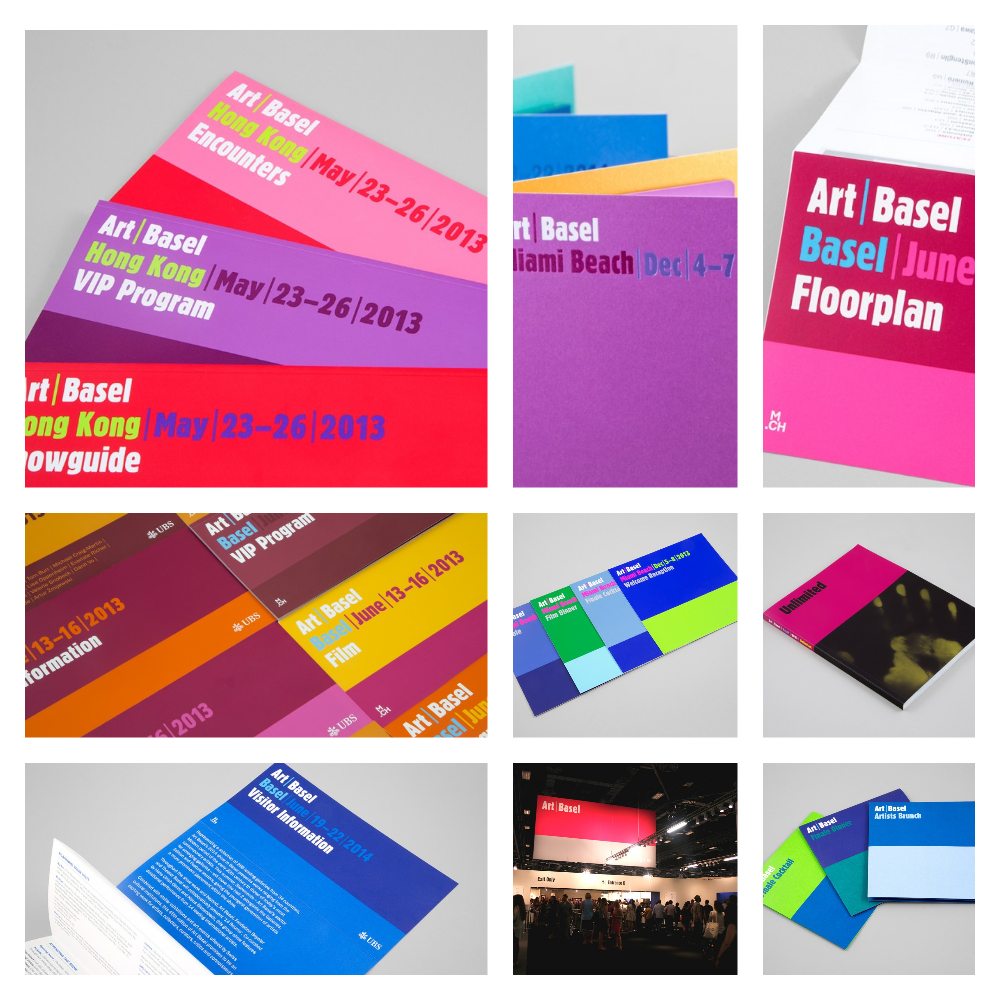

# Idee

* Re-imagine the power of the web - YouTube <https://www.youtube.com/playlist?list=PLNYkxOF6rcIA7z8m5u91ekf81ZXDjTMIZ>
  * <https://youtu.be/d8J0vs-bEPE?si=-hWLCWI9uBcEkPby>
  * CSS scroll-triggered animations are coming!  |  Blog  |  Chrome for Developers <https://developer.chrome.com/blog/scroll-triggered-animations>
* Art Basel: 2013–14 — Barnbrook Barnbrook <https://barnbrook.net/work/art-basel-2013-14/>
  * 
  * Art Basel: Rebrand — Barnbrook Barnbrook <https://barnbrook.net/work/art-basel-2018-19/>
* Applied Design Works <https://helloapplied.com/>
* Cos’è un’esperienza: il ritorno del DVD - Luca Rosati <https://www.lucarosati.it/blog/esperienza-dvd>

